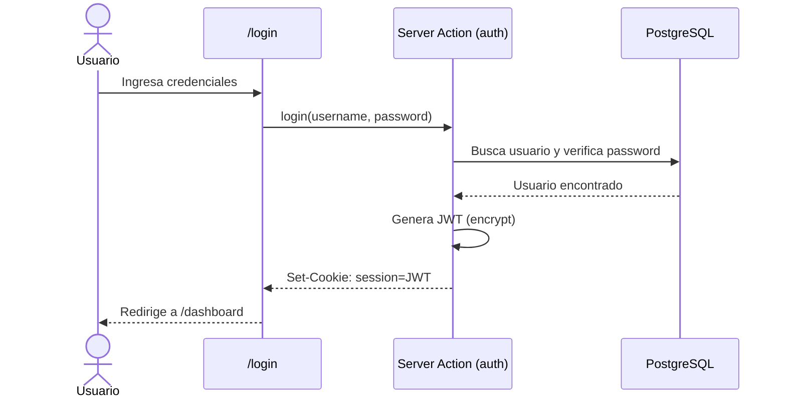

# 🔐 Autenticación y Sesiones

> [[Market-GS]] > Autenticación

---

## Mecanismo

- **Método:** JWT (JSON Web Tokens) con la librería `jose`
- **Almacenamiento:** Cookie `session` (httpOnly, secure en producción)
- **Expiración:** 24 horas (se renueva automáticamente)
- **Hash de contraseñas:** `bcryptjs`

## Flujo

## Archivos Involucrados

| Archivo                          | Responsabilidad                           |
|----------------------------------|-------------------------------------------|
| `src/lib/auth.ts`               | encrypt, decrypt, getSession, updateSession |
| `src/app/actions/auth.ts`       | Server actions: login, logout, getSession  |
| `src/components/login-form.tsx`  | Formulario de login                        |
| `src/components/register-form.tsx` | Formulario de registro                   |
| `src/app/login/page.tsx`        | Página de login                            |
| `src/app/register/page.tsx`     | Página de registro                         |

## Roles

| Rol    | Descripción                    |
|--------|--------------------------------|
| `user` | Usuario estándar (por defecto) |
| `admin`| Administrador del sistema      |

## Protección de Rutas

Todas las páginas protegidas verifican la sesión con `getSession()`. Si no hay sesión, redirigen a `/login`.
