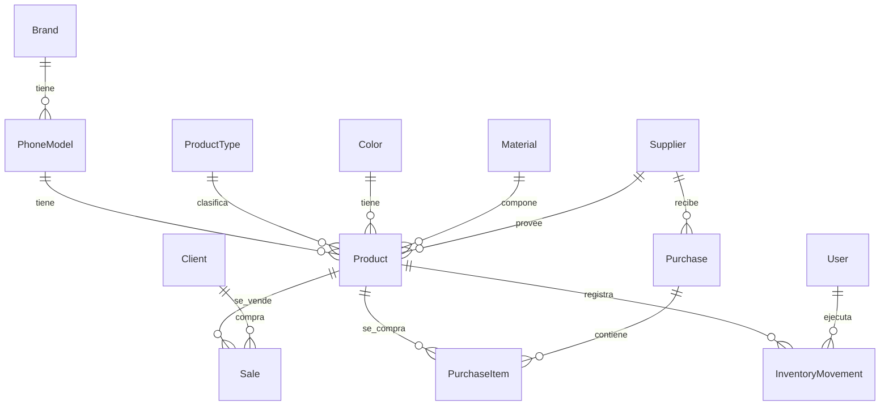

# 🗄️ Base de Datos (Prisma Schema)

> [[Market GS]] > Base de Datos

---

## Diagrama de Relaciones

---

## Modelos

### Catálogos Base

| Modelo          | Descripción                          | Campos clave                       |
|-----------------|--------------------------------------|------------------------------------|
| `Brand`         | Marcas de teléfonos (Samsung, Apple) | `name`, `logoUrl`, `status`        |
| `PhoneModel`    | Modelos de teléfono                  | `name`, `brandId`, `status`        |
| `ProductType`   | Tipos de producto (funda, vidrio)    | `name`, `status`                   |
| `Color`         | Colores disponibles                  | `name`, `hexCode`, `status`        |
| `Material`      | Materiales (silicona, plástico)      | `name`, `status`                   |
| `Compatibility` | Compatibilidad con dispositivos      | `name`, `deviceType`, `status`     |

### Entidades Principales

| Modelo     | Descripción                | Campos clave                                     |
|------------|----------------------------|--------------------------------------------------|
| `Supplier` | Proveedores                | `name`, `contact`, `email`, `phone`, `address`   |
| `Client`   | Clientes                   | `name`, `contact`, `email`, `phone`, `address`   |
| `User`     | Usuarios del sistema       | `username`, `password`, `name`, `role`, `isActive`|

### Producto

El modelo `Product` es el **centro** del sistema. Se relaciona con casi todas las demás entidades.

**Campos principales:**
- `phoneModelId` → Modelo de teléfono
- `colorId` → Color
- `typeId` → Tipo de producto
- `supplierId` → Proveedor (opcional)
- `materialId` → Material (opcional)
- `stock` / `stockDamaged` → Cantidades en inventario
- `minStock` → Stock mínimo para alertas
- `costPrice` → Precio de compra
- `priceRetail` → Precio de venta minorista
- `priceWholesale` → Precio de venta mayorista
- `hasDiscount` / `discountPercentage` / `discountPrice` → Sistema de descuentos
- `imageUrl` → Imagen del producto

### Transacciones

| Modelo              | Descripción                        | Campos clave                                                      |
|---------------------|------------------------------------|--------------------------------------------------------------------|
| `Sale`              | Venta individual                   | `productId`, `quantity`, `unitPrice`, `totalPrice`, `type` (minorista/mayorista), `clientId`, `notes`, `paymentMethod` |
| `Purchase`          | Pedido a proveedor                 | `supplierId`, `totalAmount`, `status` (pendiente/recibido/parcial/cancelado), `invoiceNumber`, `notes` |
| `PurchaseItem`      | Ítems dentro de un pedido          | `purchaseId`, `productId`, `quantityOrdered`, `quantityGood`, `quantityDamaged`, `unitCost`, `totalCost` |
| `InventoryMovement` | Movimiento de inventario           | `productId`, `type`, `quantity`, `reason`, `reference`, `notes`, `userId` |
