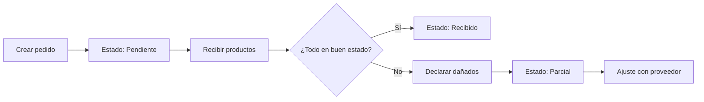

# 🛍️ Compras

> [[Market-GS]] > Compras

---

## Rutas

| Ruta                       | Descripción                          |
|----------------------------|--------------------------------------|
| `/purchases`               | Historial de compras/pedidos         |
| `/purchases/supplier`      | Gestión relacionada a proveedores    |
| `/purchases/components`    | Componentes específicos de compras   |

## Modelo `Purchase` (Pedido a Proveedor)

| Campo           | Descripción                                           |
|-----------------|-------------------------------------------------------|
| `supplierId`    | Proveedor del pedido                                  |
| `totalAmount`   | Monto total del pedido                                |
| `status`        | Estado: `pendiente`, `recibido`, `parcial`, `cancelado` |
| `invoiceNumber` | Número de factura (opcional)                          |
| `notes`         | Notas del pedido                                      |
| `receivedAt`    | Fecha de recepción                                    |

## Modelo `PurchaseItem` (Ítems del Pedido)

Cada pedido tiene múltiples ítems:

| Campo             | Descripción                       |
|-------------------|-----------------------------------|
| `purchaseId`      | Pedido al que pertenece           |
| `productId`       | Producto solicitado               |
| `quantityOrdered` | Cantidad pedida                   |
| `quantityGood`    | Cantidad que llegó en buen estado |
| `quantityDamaged` | Cantidad dañada                   |
| `unitCost`        | Costo unitario                    |
| `totalCost`       | Costo total del ítem              |

## Flujo de una Compra

## Proveedores

Los proveedores se gestionan en `/purchases/providers` (parte del módulo de [[02 - Projects/10 - Market GS/03 - Modulos/Configuracion|Configuración]]).

Cada `Supplier` tiene: nombre, contacto, email, teléfono y dirección.
