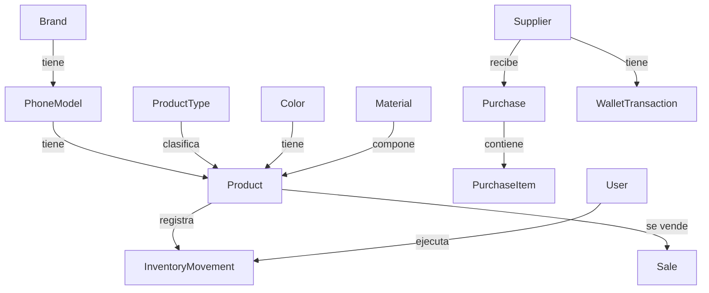

<div align="center">
  <br><br><br><br><br>

  <h1>ESPECIFICACIÓN TÉCNICA MARKET GS</h1>
  <h3>Análisis de Sistema, Arquitectura, Diseño Técnico e Integraciones de IA</h3>

  <br><br><br>

  <p>
    <strong>Preparado para:</strong> Gabriel Zabala Cespedes — CEO de Market GS<br>
    <strong>Plataforma:</strong> Web (Next.js 16)<br>
    <strong>Arquitectura & Desarrollo:</strong> T.S. Ludwing Armijo Saavedra<br>
    <strong>Fecha:</strong> Abril 2026
  </p>

  <br><br><br>

  <p><em>"Diseñado para el control total del inventario. Preparado para automatizar el negocio con IA."</em></p>

  <br><br><br><br><br>
</div>

<div style="page-break-after: always;"></div>

<div align="center">
  <br><br><br><br><br><br><br><br><br><br><br><br>

  <p><em>"Este documento no explica pantallas: explica decisiones.
  
  Cada módulo, cada tabla y cada flujo existe porque el negocio lo exige.
  
  El objetivo es que el sistema sea entendible, mantenible y escalable,
  incluso si mañana el equipo crece o el negocio se multiplica."</em></p>

  <br><br><br><br><br><br><br><br><br><br>
</div>

<div style="page-break-after: always;"></div>

## Índice General

1. [Capítulo I: Resumen Técnico y Alcance del Sistema](#capítulo-i-resumen-técnico-y-alcance-del-sistema)
2. [Capítulo II: Arquitectura de Software y Estructura del Proyecto](#capítulo-ii-arquitectura-de-software-y-estructura-del-proyecto)
3. [Capítulo III: Modelo de Datos y Persistencia (Prisma/PostgreSQL)](#capítulo-iii-modelo-de-datos-y-persistencia-prismapostgresql)
4. [Capítulo IV: Diseño de Módulos y Flujos de Negocio](#capítulo-iv-diseño-de-módulos-y-flujos-de-negocio)
5. [Capítulo V: API, Server Actions y Contratos de Integración](#capítulo-v-api-server-actions-y-contratos-de-integración)
6. [Capítulo VI: Seguridad, Autenticación y Control de Acceso](#capítulo-vi-seguridad-autenticación-y-control-de-acceso)
7. [Capítulo VII: Observabilidad, Errores y Calidad](#capítulo-vii-observabilidad-errores-y-calidad)
8. [Capítulo VIII: IA y Automatización (Visión de Producto)](#capítulo-viii-ia-y-automatización-visión-de-producto)
9. [Anexos: Roadmap Técnico y Consideraciones de Deploy](#anexos-roadmap-técnico-y-consideraciones-de-deploy)

<div style="page-break-after: always;"></div>

<div align="center">
  <br><br><br><br><br><br><br><br><br><br><br><br><br><br>
  <h1>CAPÍTULO I</h1>
  <h3>Resumen Técnico y Alcance del Sistema</h3>
  <br><br><br><br><br><br><br><br><br><br><br><br><br><br>
</div>

<div style="page-break-after: always;"></div>

## Capítulo I: Resumen Técnico y Alcance del Sistema

### I.1. Objetivo del Documento

Esta especificación técnica existe para:

- Alinear al cliente y al equipo técnico sobre cómo está diseñado el sistema.
- Explicar decisiones arquitectónicas y trade-offs.
- Facilitar mantenimiento, escalamiento e incorporación de nuevas funcionalidades.

### I.2. Alcance del Sistema

Market GS es una plataforma web con tres dominios funcionales:

1. **Sistema Privado (Dashboard):** Inventario, compras, ventas, reportes y configuración.
2. **Motor Financiero (Wallet):** Compensaciones, reclamos y trazabilidad de saldos con proveedores.
3. **Capa Pública (Landing/Catálogo):** Experiencia de conversión y catálogo para atención por WhatsApp.

### I.3. Principios Técnicos

- **Trazabilidad total:** Cada unidad debe ser rastreable desde compra hasta venta.
- **Datos como fuente de verdad:** Lo que no está en el sistema no existe.
- **Operación rápida:** Flujos optimizados para mostrador (mínimos clics).
- **Automatización progresiva:** Preparado para IA sin reescritura de base.

<div style="page-break-after: always;"></div>

<div align="center">
  <br><br><br><br><br><br><br><br><br><br><br><br><br><br>
  <h1>CAPÍTULO II</h1>
  <h3>Arquitectura de Software y Estructura del Proyecto</h3>
  <br><br><br><br><br><br><br><br><br><br><br><br><br><br>
</div>

<div style="page-break-after: always;"></div>

## Capítulo II: Arquitectura de Software y Estructura del Proyecto

### II.1. Stack Tecnológico

| Capa | Tecnología | Uso |
| :--- | :--- | :--- |
| Framework | Next.js 16 | App Router + Server Components + SSR híbrido |
| Lenguaje | TypeScript 5.9 | Tipado estricto y contratos de datos |
| UI | shadcn/ui + Tailwind CSS 4 | Componentes accesibles y diseño premium |
| DB | PostgreSQL (Supabase) | Persistencia relacional |
| ORM | Prisma 7.6 | Modelado, migraciones y queries |
| Auth | Jose (JWT) + bcryptjs | Sesiones y control de acceso |
| Validación | Zod | Esquemas de entrada y consistencia |

### II.1.1. Evidencia en código (dependencias)

El repositorio implementa el stack anterior de forma explícita en `package.json`:

- `next@^16.2.2`
- `react@19.x`
- `typescript@5.9.x`
- `prisma@^7.6.0` / `@prisma/client@^7.6.0`
- `tailwindcss@^4` + `next-themes`
- `jose@^6` + `bcryptjs@^3`
- `zod@^4`

### II.2. Estilo de Arquitectura (Monolito Modular)

La aplicación está diseñada como un **monolito modular** en Next.js:

- **UI + Server Actions** para mutaciones y flujos internos.
- **API Routes REST** para CRUDs y/o integraciones externas.

Esto reduce complejidad operativa (un solo deploy) y acelera iteración, manteniendo separación por dominios.

### II.3. Estructura de Carpetas (Vista Técnica)

```text
src/
├── app/
│   ├── actions/               # Mutaciones (auth, productos, etc.)
│   ├── api/                   # Endpoints REST (catálogos y recursos)
│   ├── (public)/              # Landing + catálogo
│   ├── (auth)/                # Login / registro
│   └── (dashboard)/           # Dashboard privado (módulos)
├── components/
│   ├── ui/                    # shadcn/ui
│   ├── providers/             # Contexts
│   └── app-sidebar.tsx        # Sidebar
├── lib/
│   ├── auth.ts                # JWT, sesión
│   ├── prisma.ts              # Prisma singleton
│   └── utils.ts               # helpers
└── data/                      # catálogos estáticos
```

### II.4. Persistencia e infraestructura en runtime

- **Prisma Client** se crea con `@prisma/adapter-pg` (`PrismaPg`) usando `DATABASE_URL`, y se cachea en `globalThis` para evitar instancias múltiples en dev.
- Algunos endpoints fuerzan `runtime = "nodejs"` para poder usar `fs` y escribir archivos de imagen.

<div style="page-break-after: always;"></div>

<div align="center">
  <br><br><br><br><br><br><br><br><br><br><br><br><br><br>
  <h1>CAPÍTULO III</h1>
  <h3>Modelo de Datos y Persistencia (Prisma/PostgreSQL)</h3>
  <br><br><br><br><br><br><br><br><br><br><br><br><br><br>
</div>

<div style="page-break-after: always;"></div>

## Capítulo III: Modelo de Datos y Persistencia (Prisma/PostgreSQL)

### III.1. Objetivo del Modelo

El esquema de datos está diseñado para:

- Controlar inventario por atributos (modelo, color, tipo, material).
- Mantener costos como ancla y permitir precios variables por venta.
- Gestionar discrepancias de compra (buenos/dañados) sin perder contabilidad.

### III.2. Diagrama de Relaciones (Referencia)



### III.3. Entidades Clave y Responsabilidades

- **`Product`**: Centro del sistema.
  - Stock vendible (`stock`) y stock dañado (`stockDamaged`).
  - Costo fijo (`costPrice`) + precios sugeridos (retail/wholesale).
  - Metadatos del producto (compatibilidades, imagen, atributos).

- **`Purchase` / `PurchaseItem`**: Entrada de mercadería.
  - Controla lo pedido vs lo recibido.
  - Base del "Filtro de Realidad".

- **`InventoryMovement`**: Libro contable de stock.
  - Cada ajuste debe dejar rastro.

- **`Sale`**: Salida de mercadería.
  - Precio variable por transacción.

- **`WalletTransaction`**: Motor financiero.
  - Compensaciones por dañados, devoluciones, acuerdos.

<div style="page-break-after: always;"></div>

<div align="center">
  <br><br><br><br><br><br><br><br><br><br><br><br><br><br>
  <h1>CAPÍTULO IV</h1>
  <h3>Diseño de Módulos y Flujos de Negocio</h3>
  <br><br><br><br><br><br><br><br><br><br><br><br><br><br>
</div>

<div style="page-break-after: always;"></div>

## Capítulo IV: Diseño de Módulos y Flujos de Negocio

### IV.1. Módulos del Sistema

- **Dashboard**: KPIs, alertas de stock, resumen financiero.
- **Inventario**: CRUD de productos + movimientos + control de mínimo.
- **Compras**: Pedidos a proveedor + recepción con buenos/dañados.
- **Ventas**: Venta minorista/mayorista con precio por transacción.
- **Wallet**: Compensaciones y saldos con proveedores.
- **Reportes**: Reportes de rentabilidad, ventas, inventario valorizado.
- **Configuración**: Catálogos (marcas, modelos, colores, materiales, proveedores, tipos).
- **Usuarios**: Roles y permisos.
- **Guía (Onboarding)**: tutorial interactivo para configurar el sistema en orden lógico.
- **Ajustes de perfil**: edición de perfil y cambio de contraseña.
- **IA (sugerencias de modelos)**: endpoint para sugerir nombres de modelos por marca (asistencia al catálogo).
- **Notificaciones**: subsistema persistente (DB) para alertas internas y eventos críticos.

### IV.2. Flujos Críticos

#### Flujo A: Recepción de compra (Filtro de Realidad)

1. Crear `Purchase` y `PurchaseItem`.
2. Al recibir: registrar `quantityGood` y `quantityDamaged`.
3. Actualizar stock vendible y stock dañado.
4. Registrar `InventoryMovement` por cada ajuste.
5. Si hay daño: abrir compensación en `WalletTransaction` (según decisión del CEO).

**Implementación real (Server Action):** `receivePurchaseAction(purchaseId, itemsData)`

- Ejecuta `prisma.$transaction()`.
- Para cada item:
  - Actualiza `PurchaseItem.quantityGood` y `quantityDamaged` (sumando `quantityLost` dentro de `quantityDamaged` para mantener esquema).
  - Incrementa `Product.stock` y `Product.stockDamaged`.
  - Registra **tres movimientos** posibles:
    - `entrada` → "Recepción de compra (Stock Bueno)"
    - `entrada` → "Recepción de compra (Dañado Vendible)"
    - `salida` → razón `perdida` + nota "Pérdida Absoluta" (cuando `quantityLost > 0`).
  - La compra queda `recibido` o `parcial` según conciliación.

#### Flujo B: Venta (precio variable)

1. Seleccionar producto y cantidad.
2. Registrar `unitPrice` real (no fijo).
3. El sistema calcula `totalPrice` y margen vs `costPrice`.
4. Descuenta stock y registra movimiento.

**Implementación real (Server Action):** `createSaleAction({ items, ... })`

- Ejecuta `db.$transaction()`.
- Soporta venta desde:
  - Stock normal (`Product.stock`)
  - Stock dañado (`Product.stockDamaged`) si `isDamagedStock = true`
- Registra ventas unitarias en `Sale`.
- Notifica a admins:
  - "Nueva venta registrada"
  - "Stock bajo detectado" cuando `stock <= minStock`.

<div style="page-break-after: always;"></div>

<div align="center">
  <br><br><br><br><br><br><br><br><br><br><br><br><br><br>
  <h1>CAPÍTULO V</h1>
  <h3>API, Server Actions y Contratos de Integración</h3>
  <br><br><br><br><br><br><br><br><br><br><br><br><br><br>
</div>

<div style="page-break-after: always;"></div>

## Capítulo V: API, Server Actions y Contratos de Integración

### V.1. Estrategia de Acceso a Datos

- **Server Actions**: operaciones internas, mutaciones rápidas (auth, productos, ventas).
- **API Routes**: CRUDs de catálogos y endpoints consumibles.

### V.1.1. Endpoints REST implementados (evidencia en código)

Los siguientes endpoints están implementados en `src/app/api/*`.

**Catálogos**

- `/api/brands`:
  - `GET` → lista marcas activas.
  - `POST` → crea marca (valida `name`, evita duplicados, opcional `logoUrl`).
- `/api/phone-models`:
  - `GET` → lista modelos por `status` (default: `active`).
  - `POST` → crea modelo validando marca activa y evitando duplicados case-insensitive por `brandId+name`.
  - `PATCH` → editar nombre.
  - `DELETE` → soft delete (status = `deleted`).
- `/api/colors`:
  - `GET` → lista activos.
  - `POST` → valida `hexCode` (`#RRGGBB` o `transparent`) y evita duplicado por nombre/hex.
- `/api/materials`:
  - `GET` / `POST`.
- `/api/product-types`:
  - `GET` / `POST`.
- `/api/compatibility`:
  - `GET` / `POST`.
- `/api/providers` (Suppliers):
  - `GET` / `POST`.

**Inventario**

- `/api/products`:
  - `GET` → lista productos activos con relaciones.
  - `POST` → crea producto vía `formData`, permite imagen.
- `/api/products/[id]`:
  - `PUT` → actualiza vía `formData`, permite imagen.
  - `PATCH` → actualiza campos simples vía JSON (ej. `status`, `minStock`).
  - `DELETE` → soft delete (status = `deleted`).

- `/api/inventory-movements`:
  - `GET` / `POST`.
- `/api/inventory-movements/[id]`:
  - `GET` / `PUT` / `DELETE`.

### V.1.2. Uploads de imagen (implementación actual)

El API de productos implementa guardado local:

- Guarda el archivo en `public/uploads/` con nombre `product_<timestamp>_<rand>.jpg`.
- Retorna `imageUrl` como ruta pública `"/uploads/<filename>"`.
- Se fuerza `runtime = "nodejs"` para usar `fs`.

**Nota técnica:** esto es perfecto para staging/local. Para producción, se recomienda migrar a un storage (S3/Supabase Storage) con CDN.

### V.2. Convenciones

- Validación de entrada con Zod.
- Respuestas con errores tipados.
- Auditoría por `InventoryMovement` para cambios de stock.

### V.3. Notificaciones internas (feature real)

Existe un subsistema de notificaciones persistidas en DB:

- Modelo: `Notification` (por usuario, con `isRead`, `type`).
- Server Actions:
  - `getNotificationsAction()` (últimas 20 + contador de no leídas).
  - `markNotificationReadAction(id)` / `markAllNotificationsReadAction()`.
  - `notifyAdminsAction(title, message, type)` → crea notificaciones para usuarios `role = 'admin'`.

### V.4. Guía (Onboarding) — Tutorial interactivo

**Objetivo:** acelerar el onboarding y reducir errores operativos, guiando al usuario a configurar catálogos y realizar las primeras operaciones.

- **Ruta:** `src/app/(dashboard)/guia/page.tsx`
- **Cliente UI:** `src/app/(dashboard)/guia/guia-client.tsx`
- **Persistencia:** el server component calcula progreso real por conteos en DB (marcas, modelos, productos, compras, ventas, wallet).
- **Finalización:** `completeTutorialAction()` (en `src/app/actions/users.ts`) marca `User.hasCompletedTutorial = true`.

**Checklist real (pasos):**

- **Cimientos:** marcas, tipos, materiales, proveedores.
- **Estructura:** modelos, colores, productos.
- **Operación:** compras, ventas, wallet.

**Riesgos/Notas:** el tutorial es “source of truth” de setup inicial; cambios en los catálogos o nuevas entidades requieren actualizar este flujo.

### V.5. Ajustes de Perfil (configuración personal)

**Objetivo:** permitir al usuario actualizar su información y contraseña.

- **Ruta:** `src/app/(dashboard)/ajustes/page.tsx`
- **Server Action:** `updateProfileAction({ name?, currentPassword?, newPassword? })`
- **Seguridad:** valida sesión, compara contraseña actual con `bcrypt.compare`, y persiste hash nuevo con `bcrypt.hash`.
- **UI:** `ProfileClient` consume `user` (id, name, username, role).

### V.6. IA: sugerencia de modelos (OpenRouter)

**Objetivo:** acelerar la creación de modelos de teléfonos sugiriendo nombres recientes por marca dentro del módulo de configuración.

- **Endpoint:** `POST /api/ai/suggest-models`
- **Implementación:** `src/app/api/ai/suggest-models/route.ts`
- **UI consumidora:** `CreateModelDialog` en `src/app/(dashboard)/configuracion/modelos/CreateModelDialog.tsx`
- **Proveedor:** OpenRouter (`https://openrouter.ai/api/v1/chat/completions`)
- **Env requerida:** `OPEN_ROUTER_KEY`

**Reglas de negocio embebidas (Apple):**

- Calcula la “serie confirmada” en función de año/mes (Apple lanza en septiembre).
- Prohíbe sugerir series por encima del último lanzamiento.
- Devuelve lista separada por comas y filtra duplicados con `existingModels`.

<div style="page-break-after: always;"></div>

<div align="center">
  <br><br><br><br><br><br><br><br><br><br><br><br><br><br>
  <h1>CAPÍTULO VI</h1>
  <h3>Seguridad, Autenticación y Control de Acceso</h3>
  <br><br><br><br><br><br><br><br><br><br><br><br><br><br>
</div>

<div style="page-break-after: always;"></div>

## Capítulo VI: Seguridad, Autenticación y Control de Acceso

- **Roles**: Admin (CEO) vs Operario.
- **Sesión**: JWT firmados + expiración.
- **Protección de rutas**: Middleware del App Router.
- **Protección de datos sensibles**: costos, wallet y reportes detallados solo Admin.

<div style="page-break-after: always;"></div>

<div align="center">
  <br><br><br><br><br><br><br><br><br><br><br><br><br><br>
  <h1>CAPÍTULO VII</h1>
  <h3>Observabilidad, Errores y Calidad</h3>
  <br><br><br><br><br><br><br><br><br><br><br><br><br><br>
</div>

<div style="page-break-after: always;"></div>

## Capítulo VII: Observabilidad, Errores y Calidad

- **Log de eventos**: registro de acciones críticas (ventas, compras, wallet).
- **Auditoría de inventario**: `InventoryMovement` como fuente de verdad.
- **Pruebas**: pruebas mínimas de flujos críticos (recibir compra, vender, ajustar stock).

<div style="page-break-after: always;"></div>

<div align="center">
  <br><br><br><br><br><br><br><br><br><br><br><br><br><br>
  <h1>CAPÍTULO VIII</h1>
  <h3>IA y Automatización (Visión de Producto)</h3>
  <br><br><br><br><br><br><br><br><br><br><br><br><br><br>
</div>

<div style="page-break-after: always;"></div>

## Capítulo VIII: IA y Automatización (Visión de Producto)

Esta sección formaliza funcionalidades inteligentes planificadas.

### VIII.1. Extracción de especificaciones desde imágenes (Input Inteligente)

**Objetivo:** cuando se sube una imagen de un producto (funda, vidrio, cable), el sistema puede proponer atributos para acelerar el alta.

**Posibles salidas (sugerencias):**

- Tipo de accesorio (funda / vidrio / cable / manilla).
- Color aproximado (hex + nombre).
- Material probable (silicona / TPU / rígida).
- Modelo compatible (si el diseño/corte es identificable).
- Detección de marca/modelo impreso (OCR si aplica).

**Impacto en UX:** reduce tiempos de alta, estandariza nombres y baja errores humanos.

### VIII.2. Detección de producto para venta desde imagen (Búsqueda Visual)

**Objetivo:** el vendedor toma una foto del producto (o caja) y el sistema sugiere coincidencias del inventario para vender rápido.

**Estrategia:**

- Generar embeddings de imagen para productos existentes.
- Al buscar, comparar con embeddings y devolver top matches.
- Validar por atributos (modelo, tipo, color) antes de confirmar.

### VIII.3. Recomendaciones y prevención de quiebres

- Alertas predictivas por `minStock` + ritmo de ventas.
- Recomendación de compra por proveedor según historial.

<div style="page-break-after: always;"></div>

## Anexos: Roadmap Técnico y Consideraciones de Deploy

### A.1. Roadmap Técnico

1. Core estabilizado: inventario + compras + ventas + wallet.
2. Reportería avanzada y KPIs.
3. Catálogo público con control de publicación.
4. IA: extracción de atributos + búsqueda visual.

### A.2. Consideraciones de Deploy

- **DB:** Supabase PostgreSQL.
- **App:** Vercel o equivalente.
- **Ambientes:** dev/staging/prod.
- **Backups:** snapshots automáticos.

---

> **Documento técnico — Market GS**
> 
> *Versión 2.0 - Abril 2026*
