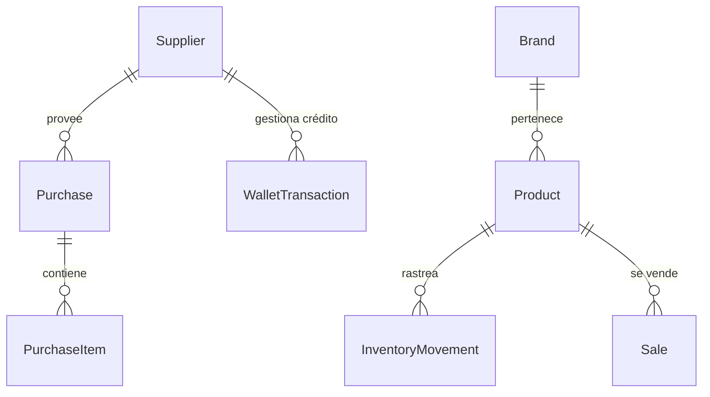

# 🛠️ Especificación Técnica: Market GS

Este documento detalla la arquitectura, el diseño de sistemas y el análisis técnico de la plataforma **Market GS**, diseñada para la gestión integral de inventario, ventas y presencia digital boutique.

---

## 1. Análisis del Sistema

### 🎯 Objetivos Técnicos
- **Escalabilidad:** Arquitectura basada en Next.js App Router para soportar crecimiento en tráfico y datos.
- **Integridad de Datos:** Uso de PostgreSQL con Prisma ORM para garantizar transacciones seguras y relaciones complejas.
- **Performance:** Optimización de carga (LCP) mediante Server Components y almacenamiento en el borde.
- **UX Premium:** Interfaz de alta fidelidad con "True Black" Dark Mode y micro-interacciones.

### 🧩 Alcance del Sistema
El sistema se divide en tres capas principales:
1. **Core Administrativo (Dashboard):** Gestión de inventario, compras, ventas y reportes financieros.
2. **Capa de Negocio (Wallet):** Sistema de compensación y créditos con proveedores.
3. **Capa Pública (Landing/Catálogo):** Motor de conversión enfocado en ventas por WhatsApp.

---

## 2. Arquitectura de Software

### 🏗️ Stack Tecnológico (Modern Stack 2026)
| Capa | Tecnología | Razón de Elección |
| :--- | :--- | :--- |
| **Framework** | Next.js 16 (App Router) | Renderizado híbrido (SSR/ISR) y Server Actions. |
| **Lenguaje** | TypeScript 5.9 | Tipado estricto para reducir errores en tiempo de ejecución. |
| **Base de Datos** | PostgreSQL (Supabase) | Robustez relacional y escalabilidad gestionada. |
| **ORM** | Prisma 7.6 | Modelado de datos declarativo y migraciones automatizadas. |
| **Estilos** | Tailwind CSS 4 | Diseño atómico y performance en el bundle de CSS. |
| **Componentes** | shadcn/ui (Radix) | Accesibilidad (A11y) y personalización total del diseño. |

### 📁 Estructura del Proyecto
```text
src/
├── app/                  # Rutas y lógica de servidor (Next.js)
│   ├── actions/          # Mutaciones de datos (Server Actions)
│   ├── api/              # Endpoints REST para integraciones
│   ├── (dashboard)/      # Módulos privados (Auth required)
│   └── (public)/         # Landing y Catálogo público
├── components/           # Librería de componentes React
├── lib/                  # Servicios (Prisma, Auth, Utils)
└── prisma/               # Esquema y definiciones de base de datos
```

---

## 3. Diseño de Base de Datos

El motor del sistema es un esquema relacional optimizado para la trazabilidad total de productos desde su compra hasta su venta.

### 📊 Diagrama de Entidad-Relación (Simplificado)


### 🗝️ Entidades Clave
- **`Product`**: Entidad central con gestión de stock (bueno/dañado), precios mayoristas/minoristas y costos.
- **`Purchase`**: Flujo de entrada con "Filtro de Realidad" para validar discrepancias entre lo pedido y lo recibido.
- **`Wallet`**: Sistema contable que rastrea saldos a favor o deudas con proveedores por productos dañados o devoluciones.

---

## 4. Diseño de Interfaz y UX

### 🎨 Filosofía Visual: "Boutique Street-Tech"
- **Paleta:** `#000000` (Background), `#FFFFFF` (Text), `#111111` (Cards).
- **Tipografía:** Geist (Modernista/Geométrica).
- **UX Core:** 
  - **Fricción Cero:** Reducción de clicks para acciones críticas (ej. Nueva Venta).
  - **Mobile First:** El 90% de la gestión de inventario ocurre en dispositivos móviles.

---

## 🔒 5. Seguridad y Autenticación
- **Middleware:** Protección de rutas a nivel de servidor.
- **Auth:** Lógica basada en JWT (Jose) con almacenamiento de sesión seguro.
- **Validación:** Esquemas de **Zod** en todos los puntos de entrada de datos (Client & Server).

---

## 🚀 6. Roadmap de Implementación
1. **Fase 1:** Core de Inventario y Base de Datos (Completado).
2. **Fase 2:** Módulo de Ventas y Wallet de Proveedores (En progreso).
3. **Fase 3:** Landing Page de Conversión PAS y Catálogo (En progreso).
4. **Fase 4:** Inteligencia de Negocio y Reportes Predictivos (Planificado).

---
> **Documento generado por Antigravity AI**  
> *Versión 1.0 - Abril 2026*
