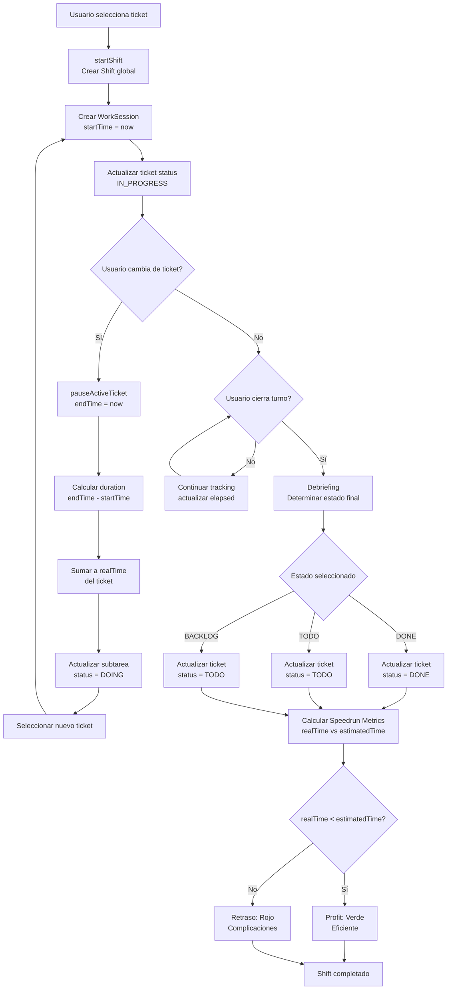

# Motor de Tiempos y "Speedrun"

El ecosistema de `ob-office-management` utiliza un sistema de registro de tiempo de alta fidelidad, diseñado no solo para rastrear asistencia, sino para gamificar la eficiencia operativa mediante el concepto de **"Speedrun"**.

## Arquitectura de Datos (Prisma)
El tiempo se gestiona a través de tres capas jerárquicas:

1. **Shift (Turnos Globales):** Registra el momento en que un operador entra "en línea". Acumula las horas totales que se muestran en su perfil.
2. **WorkSessions (Sesiones Operativas):** Registran fragmentos de tiempo dedicados específicamente a un Ticket. Si un operador pausa un ticket y vuelve más tarde, se crean múltiples sesiones de trabajo.
3. **Métricas en Tickets:**
   - `estimatedTime`: Tiempo teórico en minutos que el requerimiento debería tomar. 
   - `realTime`: Suma total en minutos de todas las `WorkSessions` ligadas al requerimiento.

## Flujo de Turno (Shift Controller)
La cabecera del Dashboard (`ShiftManager`) controla este ciclo de vida:

- **Inicio de Protocolo (`startShift`)**: El usuario no puede simplemente "iniciar el cronómetro". Obligatoriamente debe seleccionar un requerimiento del Backlog o Tareas Pendientes. Al seleccionarlo, arranca el cronómetro global y el ticket se mueve automáticamente a `IN_PROGRESS`.
- **Pausa Activa (`pauseActiveTicket`)**: Si el usuario necesita dejar el ticket y tomar otro, el cronómetro de la sesión del ticket actual se detiene, sumando su duración a `realTime`.
- **Debriefing (Fin de Turno)**: Al cerrar el turno, se le exige al usuario determinar el estado del requerimiento activo:
  - *Misión Cumplida (DONE)*: El ticket se cierra exitosamente.
  - *Pausar en Pendientes (TODO)*: Queda listo para ser retomado.
  - *Devolver al Backlog*: Se replantea su prioridad.

### Diagrama de Flujo de Time Tracking

## Speedrun Metrics (Profit vs Retraso)
En el **Perfil del Usuario**, el Historial de Operaciones compara los tiempos.
- **Profit (Verde):** `realTime < estimatedTime`. Representa un despliegue altamente eficiente donde el operador gastó menos horas de las proyectadas.
- **Retraso (Rojo):** `realTime > estimatedTime`. Representa complicaciones operativas.

## Subtask Live Timers (En Desarrollo)
El sistema también desciende a nivel microscópico midiendo en tiempo real el cumplimiento de las subtareas individuales (arquitectura Split) directamente desde las vistas de Kanban.
