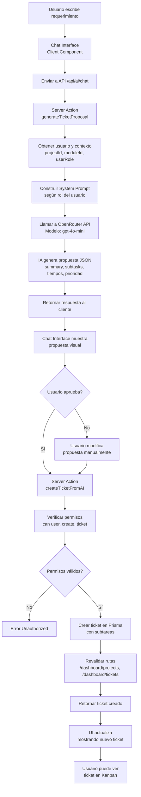

---
tags:
  - OBWorkspace
  - OB-Workspace
  - obworkspace
  - AI
  - Workflow
---
# Flujo IA: Del Chat a la Acción (Ticket Architect)

##  El Corazón Inteligente de OB-Workspace

A diferencia de un chat convencional, la IA en este workspace actúa como un **Arquitecto de Software**. Su objetivo no es solo responder dudas, sino estructurar el trabajo técnico.

###  Flujo de Generación Estructurada

1.  **Prompt de Sistema (System Prompt):** Ubicado en la configuración de IA, obliga al modelo (`gpt-4o-mini`) a comportarse como un Project Manager Senior.
2.  **Inferencia de Requerimientos:** Cuando el usuario describe una tarea ("Necesito arreglar el login"), el modelo analiza el texto y genera:
    - Una explicación amigable del plan de acción.
    - Un bloque **`JSON_PROPOSAL`** (invisible al usuario en su forma cruda, formateado visualmente en el frontend).
3.  **El Botón Mágico "Aprobar y Crear":**
    - El componente de chat detecta el JSON estructurado.
    - Ofrece al usuario un botón de acción rápida.
4.  **Mutación Atómica (Server Action):**
    - Al aprobar, los datos viajan a `createTicketFromAI`.
    - Prisma crea el `Ticket` y desglosa automáticamente las `Subtasks` con los tiempos estimados por la IA.
5.  **Contextualización Dinámica (New):**
    - El asistente ahora hereda el `projectId` y `moduleId` mediante parámetros de URL.
    - La interfaz de chat muestra un badge del proyecto activo y personaliza el saludo inicial.
    - La tarjeta de propuesta incluye un selector de destino explícito, permitiendo confirmar o cambiar la asignación (Proyecto vs Módulo) antes de la creación final.

### Diagrama de Flujo: Del Chat al Ticket

### Ejemplo Completo de Flujo

#### Escenario: Usuario solicita implementación de autenticación

**Usuario:**
Necesito implementar autenticación con Google OAuth en el proyecto CRM

**IA Response (JSON Proposal):**
- **Resumen:** Implementación completa de Google OAuth para autenticación de usuarios en el proyecto CRM
- **Tiempo Total:** 240 minutos (4 horas)
- **Prioridad:** HIGH
- **Módulo Sugerido:** Authentication

**Subtareas Generadas:**
1. Configurar Google Cloud Console y obtener credenciales OAuth (30 min) - HIGH
2. Instalar y configurar NextAuth.js con Google Provider (45 min) - HIGH
3. Crear endpoints de API para autenticación (60 min) - HIGH
4. Actualizar modelo User en Prisma para almacenar Google ID (30 min) - MEDIUM
5. Crear UI de login con botón de Google (45 min) - MEDIUM
6. Implementar middleware de protección de rutas (30 min) - HIGH

**UI Response:**
He analizado tu requerimiento de implementar Google OAuth. Aquí está mi propuesta estructurada:

## Resumen
Implementación completa de Google OAuth para autenticación de usuarios en el proyecto CRM

## Plan de Acción
He desglosado la implementación en 6 subtareas con un tiempo estimado total de 4 horas:

1. Configurar Google Cloud Console y obtener credenciales OAuth (30 min) - HIGH
2. Instalar y configurar NextAuth.js con Google Provider (45 min) - HIGH
3. Crear endpoints de API para autenticación (60 min) - HIGH
4. Actualizar modelo User en Prisma para almacenar Google ID (30 min) - MEDIUM
5. Crear UI de login con botón de Google (45 min) - MEDIUM
6. Implementar middleware de protección de rutas (30 min) - HIGH

[Botón: Aprobar y Crear Ticket] [Botón: Modificar Propuesta]

###  Casos de Uso Específicos

#### Caso 1: Refactorización de Código

**Usuario:**
El componente UserProfile.tsx tiene 500 líneas y es difícil de mantener. Necesito refactorizarlo.

**IA Response:**
- **Resumen:** Refactorización de UserProfile.tsx para mejorar mantenibilidad y legibilidad
- **Tiempo Total:** 180 minutos (3 horas)
- **Prioridad:** MEDIUM
- **Módulo Sugerido:** Frontend

**Subtareas Generadas:**
1. Analizar estructura actual del componente (30 min) - MEDIUM
2. Extraer componentes reutilizables (UserAvatar, UserStats, UserSettings) (60 min) - HIGH
3. Implementar custom hooks para lógica de negocio (45 min) - MEDIUM
4. Optimizar rendimiento con React.memo y useMemo (30 min) - LOW
5. Actualizar tests unitarios para nuevos componentes (15 min) - MEDIUM

#### Caso 2: Corrección de Bug

**Usuario:**
El formulario de contacto no envía emails cuando el usuario usa Gmail. Solo funciona con otros proveedores.

**IA Response:**
- **Resumen:** Investigación y corrección de bug en envío de emails a Gmail
- **Tiempo Total:** 90 minutos (1.5 horas)
- **Prioridad:** CRITICAL
- **Módulo Sugerido:** Backend

**Subtareas Generadas:**
1. Revisar logs de errores en servidor de emails (20 min) - HIGH
2. Verificar configuración SPF/DKIM/DMARC (30 min) - HIGH
3. Probar envío con diferentes proveedores de email (20 min) - MEDIUM
4. Implementar corrección y validar con Gmail (20 min) - HIGH

#### Caso 3: Nueva Feature

**Usuario:**
Quiero agregar un dashboard de analytics para el CEO con métricas financieras y de rendimiento del equipo.

**IA Response:**
- **Resumen:** Desarrollo de dashboard de analytics para CEO con métricas financieras y de equipo
- **Tiempo Total:** 480 minutos (8 horas)
- **Prioridad:** HIGH
- **Módulo Sugerido:** Analytics

**Subtareas Generadas:**
1. Definir KPIs y métricas a mostrar (60 min) - HIGH
2. Crear endpoints de API para datos agregados (90 min) - HIGH
3. Diseñar layout y componentes del dashboard (60 min) - MEDIUM
4. Implementar gráficos con Recharts o Tremor (90 min) - HIGH
5. Agregar filtros y selector de período (45 min) - MEDIUM
6. Implementar caching para performance (45 min) - MEDIUM
7. Protección de ruta (solo CEO) (30 min) - HIGH
8. Testing y validación con CEO (60 min) - MEDIUM

###  Contexto de Rol (ABAC Injected)

Para que la IA no proponga cosas fuera de lugar, el sistema inyecta el rol del usuario (`CEO`, `DEV`, `CLIENT`) en cada mensaje de forma programática.

#### Ejemplo por Rol

**CEO:**
**Usuario:** ¿Cómo podemos mejorar la rentabilidad de los proyectos?

**IA Response (CEO Context):**
Para mejorar la rentabilidad de los proyectos, te sugiero:

1. **Análisis de Margen por Proyecto**: Implementar un dashboard que compare presupuesto vs gastos reales
2. **Alertas de Desviación**: Notificaciones automáticas cuando un proyecto excede el 80% del presupuesto
3. **Optimización de Recursos**: Reasignar desarrolladores basándose en carga de trabajo actual
4. **Revisión de Gastos Fijos**: Auditoría mensual de suscripciones y servicios recurrentes

¿Quieres que cree un ticket para implementar alguna de estas iniciativas?

**Developer:**
**Usuario:** ¿Cómo puedo optimizar el rendimiento del KanbanBoard?

**IA Response (Developer Context):**
Para optimizar el rendimiento del KanbanBoard, te recomiendo:

1. **Server Components**: Cargar datos en el servidor para reducir payload de JavaScript
2. **React Cache**: Implementar caching de queries de Prisma
3. **Virtual Scrolling**: Si tienes muchos tickets, considera react-window o react-virtualized
4. **Suspense Boundaries**: Cargar columnas del Kanban de forma progresiva
5. **Optimistic Updates**: Usar useOptimistic para actualizaciones instantáneas visuales

¿Quieres que cree un ticket para implementar alguna de estas optimizaciones?

**External Client:**
**Usuario:** ¿Cuándo estará listo mi proyecto?

**IA Response (Client Context):**
Basado en el progreso actual de tu proyecto "CRM System":

**Progreso General**: 65% completado
**Tickets Pendientes**: 12 tickets restantes
**Tiempo Estimado**: 3-4 semanas para finalización

**Próximos Hitos**:
- Semana 1: Finalizar módulo de autenticación
- Semana 2: Implementar dashboard de analytics
- Semana 3: Testing y correcciones
- Semana 4: Deploy y release

¿Te gustaría que agende una reunión de seguimiento para discutir el progreso?

###  Integración con el Sistema

#### Server Action: createTicketFromAI

**Propósito:** Crear ticket y subtareas desde propuesta de IA

**Flujo de Ejecución:**
1. Obtiene usuario actual autenticado
2. Verifica permisos con función `can(user, 'create', 'ticket')`
3. Crea ticket principal en Prisma con:
   - Título: summary de la propuesta
   - Descripción: requerimiento original + lista de subtareas
   - Tiempo estimado: estimatedTotalTime
   - Prioridad: suggestedPriority
   - Proyecto y módulo seleccionados
   - Creator ID del usuario actual
4. Crea todas las subtareas en una sola transacción
5. Revalida rutas `/dashboard/projects` y `/dashboard/tickets`
6. Retorna ticket creado

**Validaciones:**
- Verificación de permisos ABAC
- Validación de datos de propuesta
- Transacción atómica para consistencia

#### Componente: AIProposalCard

**Propósito:** Mostrar propuesta de IA con acciones de aprobación/modificación

**Estructura Visual:**
- Card con borde primary para destacar
- Header con título "Propuesta de IA" y tiempo total
- Sección de resumen con descripción del requerimiento
- Lista de subtareas con:
  - Título de subtarea
  - Tiempo estimado (horas y minutos)
  - Badge de prioridad (LOW, MEDIUM, HIGH, CRITICAL)
- Botones de acción:
  - "Aprobar y Crear": Ejecuta createTicketFromAI
  - "Modificar": Abre diálogo para edición manual

**Características:**
- Formato de tiempo: Xh Ym (ej: 2h 30m)
- Colores de prioridad visuales
- Responsive design
- Loading states durante creación

##  Relacionado
- [[Orquestacion AI|Ver Configuración Técnica de IA]]
- [[../../05 - Backend/Server Actions|Acciones de Servidor Relacionadas]]
- [[../../02 - Base de Datos/Modelos Prisma|Modelos de Tickets y Subtareas]]
