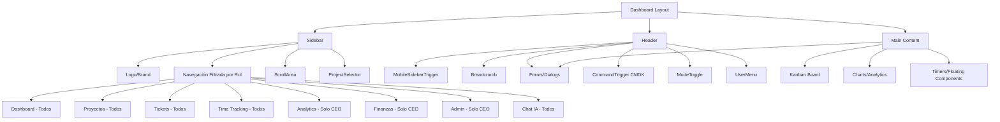

---
tags:
  - OBWorkspace
  - OB-Workspace
  - obworkspace
  - Frontend
  - Navigation
---
# Layouts, Navegación y UX

##  Experiencia de Usuario Centralizada

El diseño de **OB Workspace** se basa en un layout "App-Shell" que maximiza el espacio de trabajo para el desarrollo y la gestión.

### Estructura de Navegación

#### 1. Sidebar Inteligente

El sidebar cambia o destaca elementos según el rol y el contexto actual:

**Componentes del Sidebar:**
- Logo/Brand: "OB Workspace"
- Navegación: Items filtrados por rol del usuario
- ScrollArea: Para navegación larga
- ProjectSelector: Selector de proyecto en el footer

**Items de navegación:**
- Dashboard, Proyectos, Tickets, Time Tracking: Todos
- Analytics, Finanzas, Admin: Solo CEO
- Chat IA: Todos

**Comportamiento:**
- Filtra items según el rol del usuario
- Destaca item activo con variant 'secondary'
- Usa íconos de Lucide
- Ancho fijo de 64 unidades

**Características del Sidebar:**

- **Contextual:** El sidebar cambia o destaca elementos según el rol
- **Módulos Activos:** Acceso directo a `Kanban`, `Proyectos`, `Time Tracking` y el `Chat AI`
- **Selector de Proyecto:** Permite cambiar el contexto global de visualización
- **Responsive:** Se oculta en móviles y se muestra con un menú hamburguesa

#### 2. Header Global

**Componentes del Header (izquierda):**
- MobileSidebarTrigger: Botón hamburguesa para móviles
- Breadcrumb: Navegación jerárquica

**Componentes del Header (derecha):**
- TimerDisplay: Cronómetro de sesión activa
- CommandTrigger: Botón para abrir CMDK (Cmd+K)
- ModeToggle: Cambio de tema claro/oscuro
- UserMenu: Menú de usuario con avatar

**Estilos:**
- Altura fija de 16 unidades
- Efecto backdrop-blur
- Borde inferior
- Espaciado uniforme

#### 3. Componentes de UI (Radix + Shadcn)

**Kanban Board:**

Implementado con arrastrar y soltar (Dnd-kit o similar), interactuando directamente con las *Server Actions*:

**Librería:** Dnd-kit para drag and drop

**Columnas del Kanban:**
- TODO: Tickets pendientes
- IN_PROGRESS: En desarrollo
- IN_REVIEW: En revisión
- DONE: Completados

**Flujo de interacción:**
1. Usuario arrastra ticket a otra columna
2. Evento DragEnd captura ticketId y newStatus
3. Llama a Server Action updateTicketStatus
4. Revalida rutas automáticamente

**Layout:**
- Grid de 4 columnas
- Gap de 4 unidades
- SortableContext para ordenamiento vertical

**Timer Flotante:**

Un componente global (Client Component) que persiste mientras el usuario navega, mostrando el tiempo de la `WorkSession` activa:

**Estados:**
- isActive: Boolean indicando si el timer está corriendo
- elapsed: Segundos transcurridos

**Lógica:**
- Intervalo de 1 segundo cuando isActive es true
- Formato: HH:MM:SS
- Persiste mientras el usuario navega

**UI:**
- Muestra tiempo en formato monoespaciado
- Botón Play/Pause con íconos de Lucide
- Estilo ghost para no distraer
- Visible en header global

**Comandos Rápidos (CMDK):**

Una barra de búsqueda tipo Raycast (`Cmd+K`) para saltar rápidamente entre tickets o proyectos:

**Librería:** CMDK (Command Palette)

**Atajo de teclado:** Cmd+K (Mac) o Ctrl+K (Windows)

**Funcionalidades:**
- Busca tickets y proyectos simultáneamente
- Mínimo 2 caracteres para buscar
- Resultados agrupados por tipo
- Navegación con teclado

**Server Actions:**
- searchTickets(query): Busca tickets por título/descripción
- searchProjects(query): Busca proyectos por nombre

**UI:**
- Input con placeholder
- Groups: "Tickets" y "Proyectos"
- Items clickeables para navegar

### Visualización de Datos

Uso de componentes de **Tremor** o **Recharts** en el dashboard del CEO para visualizar la quema de presupuesto (`Expenses`) versus el progreso técnico (`Tickets Done`):

**Librería:** Recharts o Tremor

**Datos visualizados:**
- Presupuesto: Monto total del proyecto
- Gastado: Suma de expenses del proyecto
- Progreso: Porcentaje de tickets en estado DONE

**Componentes del gráfico:**
- ResponsiveContainer: Adaptable al contenedor
- BarChart: Gráfico de barras
- CartesianGrid: Líneas de guía
- XAxis: Nombres de proyectos
- YAxis: Valores monetarios
- Tooltip: Información al hover
- Bars: Presupuesto (azul) y Gastado (verde)

**Uso:** Dashboard del CEO para análisis financiero

### Layouts por Contexto

#### Dashboard Layout

**Estructura del layout:**
- Sidebar: Navegación lateral fija (izquierda)
- Header: Barra superior fija
- Main: Área de contenido scrollable

**Layout:**
- Flex container horizontal
- Sidebar con ancho fijo
- Área principal con flex-1
- Header con altura fija
- Main con overflow-y-auto

**Padding:**
- Main tiene padding de 6 unidades
- Contenido centrado y legible

### Diagrama de Estructura de Layout (Dashboard)

#### Portal Layout (Clientes Externos)

**Estructura del layout:**
- PortalHeader: Header específico para clientes externos
- Main: Área de contenido centrada

**Layout:**
- Sin sidebar (más simple)
- Container con max-width
- Padding vertical de 8 unidades
- Min-height-screen

**Diferencias con Dashboard:**
- Sin navegación lateral
- Header simplificado
- Foco en visibilidad del progreso
- Diseño más limpio para clientes

### Patrones de UX

#### 1. Optimistic Updates

**Hook:** useOptimistic de React

**Flujo:**
1. Usuario arrastra ticket
2. addOptimisticTicket actualiza UI inmediatamente
3. updateTicketStatus se llama al servidor
4. Si falla, UI revierte al estado original

**Beneficios:**
- Respuesta instantánea
- Mejor percepción de velocidad
- Rollback automático si falla

**UI:**
- Cursor grab/grabbing
- Ring cuando está en IN_PROGRESS
- Muestra estado optimista

#### 2. Skeleton Loading

**Componente Skeleton:**
- Placeholder gris con animación pulse
- Estilo muted

**Uso con Suspense:**
- Mientras carga KanbanBoard
- KanbanSkeleton: Grid de skeletons de tickets
- Transición suave al cargar

**Beneficios:**
- Mejor percepción de carga
- Evita layout shift
- Experiencia más profesional

#### 3. Error Boundaries

**Componente ErrorBoundary:**
- Class Component de React
- Captura errores en componentes hijos
- Muestra fallback personalizado

**Fallback por defecto:**
- Mensaje "Error" en color destructivo
- Instrucción para recargar la página
- Estilo con borde y fondo

**Beneficios:**
- Evita que la app se rompa completamente
- Experiencia más robusta
- Permite recuperación del usuario

##  Relacionado
- [[Roles RBAC|Control de Acceso (RBAC)]]
- [[../03 - Inteligencia Artificial/Orquestacion AI|Asistente IA Integrado]]
- [[../01 - Arquitectura/Arquitectura General|Arquitectura del Sistema]]
