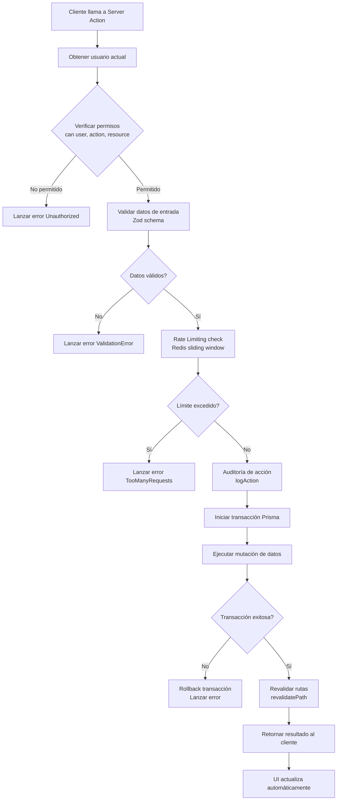

---
tags:
  - OBWorkspace
  - OB-Workspace
  - obworkspace
  - Backend
  - Server Actions
---
# Server Actions: Mutaciones Atómicas

##  Centralización de Mutaciones

Las Server Actions centralizan la mutación de datos para mantener los Server Components limpios y seguros.

### Acciones por Dominio

#### Gestión de Proyectos/Tickets (`tickets.ts`)

**Funciones principales:**
- `createTicket(data)`: Crea nuevo ticket con permisos ABAC
- `updateTicketStatus(ticketId, status)`: Cambia estado del ticket
- `deleteTicket(ticketId)`: Elimina ticket con verificación de permisos
- `assignCollaborator(ticketId, userId)`: Asigna colaborador a ticket
- `moveTicket(ticketId, newStatus)`: Mueve ticket en kanban

**Características:**
- Todas las acciones verifican permisos con `can()`
- Revalidación automática de rutas con `revalidatePath()`
- Manejo de errores con mensajes descriptivos
- Transacciones atómicas para operaciones críticas

### Diagrama de Flujo de Server Actions

#### 2. Gastos y Finanzas (`expenses.ts`)
- *Restringido:* Estas acciones verifican internamente el rol `CEO` antes de proceder.
- `registerExpense(data)`: Asocia gastos a proyectos específicos para calcular la rentabilidad real.

## 🔗 Relacionado
- [[../02 - Base de Datos/Modelos Prisma|Ver Modelos de Datos Relacionados]]
- [[../01 - Arquitectura/Arquitectura General|Arquitectura de Capas]]
