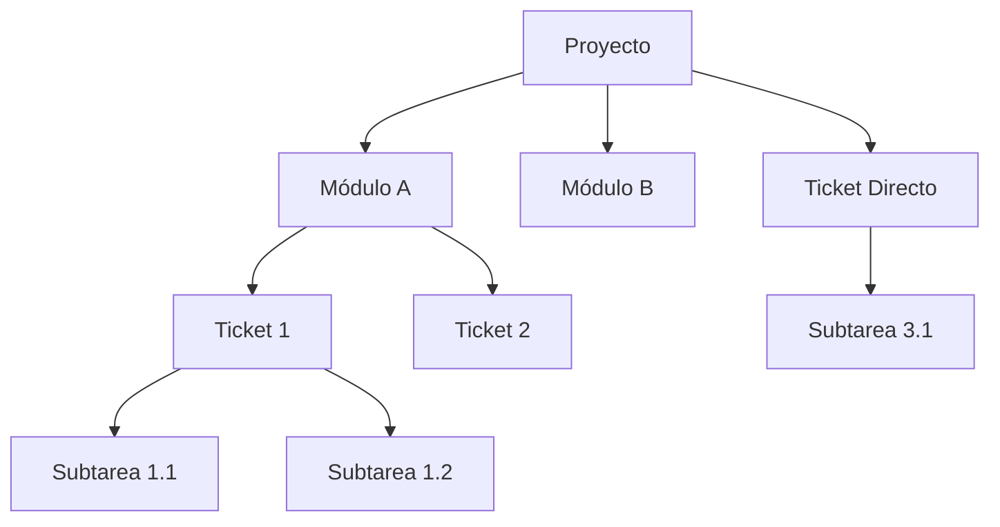

---
tags:
  - OBWorkspace
  - Arquitectura
  - Jerarquia
  - ProjectManagement
  - Obworkspace
  - Work
---
# Jerarquía y Estructura de Trabajo

Para mantener el orden en el desarrollo de software y la gestión empresarial, OB-Workspace utiliza una estructura jerárquica de 4 niveles. Comprender esta división es clave para organizar el backlog de forma eficiente.

## 🏛️ 1. Proyecto (Project)
Es el contenedor de más alto nivel. Representa un producto final, una aplicación completa o un cliente específico.
- **Ejemplo:** `OB-Workspace`, `Marketplace App`, `Sistema de Inventarios`.
- **Uso:** Agrupar todo el historial, equipo y recursos de una iniciativa global.

## 📦 2. Módulo (Module)
Es una subdivisión **lógica y funcional** dentro de un proyecto. Sirve para parcelar grandes aplicaciones en trozos manejables.
- **¿Cuándo usarlo?:** Cuando un proyecto crece tanto que tiene áreas independientes.
- **Ejemplo:** Dentro del proyecto `OB-Workspace`, podríamos tener los módulos:
    - `Auth & Security` (Manejo de logins y roles).
    - `AI Engine` (Todo lo relacionado con el asistente y OpenRouter).
    - `Billing` (Pasarelas de pago y facturas).
- **Nota:** Un proyecto puede tener tickets directos sin necesidad de módulos si es pequeño.

## 🎫 3. Ticket / Requerimiento (Requirement)
Representa una unidad de trabajo con valor de negocio. Es el "Qué" necesitamos hacer.
- **Relación Flexible:** Puede pertenecer a un Proyecto (o Módulo), pero también puede existir como un **Ticket Independiente** (suelto).
- **Tickets Huérfanos:** Son tareas que no están vinculadas a un proyecto específico. Útiles para recordatorios, tareas externas o requerimientos que aún no tienen un destino definido.
- **Ejemplo:** "Comprar servidor de backup", "Corregir bug de carga en el dashboard".

## 🛠️ 4. Subtarea (Subtask)
Es el nivel más granular y técnico. Es el "Cómo" se va a construir el ticket. 
- **Opcionalidad:** Un ticket puede existir **sin subtareas**. Las subtareas son recomendables para requerimientos complejos que necesitan un desglose técnico por parte de la IA, pero no son obligatorias para tareas simples.
- **Ejemplo:** Para el ticket "Login con Google":
    1. Configurar credenciales en Google Cloud Console (30m).
    2. Instalar librería de NextAuth (15m).
    3. Crear ruta de callback de API (45m).
    4. Diseñar botón de login en la UI (20m).

## 👥 5. Equipo y Responsabilidades (Team)
Cada ticket puede tener asignado un equipo de trabajo para asegurar su cumplimiento:
- **Líder (Lead):** Es el responsable principal del ticket. Es la cara visible del requerimiento. Solo puede haber **un líder** por ticket.
- **Colaboradores (Collaborators):** Son miembros adicionales que apoyan en la ejecución de las tareas. Un ticket puede tener múltiples colaboradores.
- **Uso:** El sistema utiliza un "Avatar Stack" en la interfaz para mostrar visualmente a todos los implicados.

---

## 🧭 Resumen de la Estructura (Diagrama)

## 💡 ¿Cómo elegir?
1. **¿Es un producto nuevo?** -> Crea un **Proyecto**.
2. **¿Es una funcionalidad compleja con muchas partes?** -> Crea un **Módulo** dentro del proyecto.
3. **¿Es una tarea concreta para el usuario?** -> Crea un **Ticket**.
4. **¿Son los pasos técnicos para el programador?** -> La IA generará las **Subtareas**.

---
[[App Web OB-Workspace|Volver al Resumen]]
