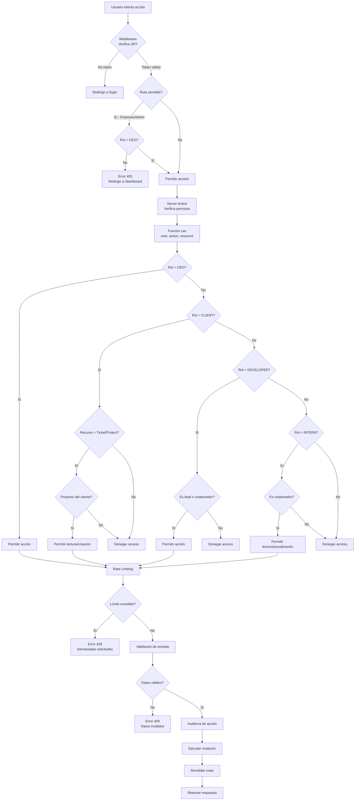

---
tags:
  - OBWorkspace
  - OB-Workspace
  - obworkspace
  - Backend
  - Security
---
# Seguridad, Permisos y ABAC (Attribute-Based Access Control)

##  Lógica de Autorización Contextual

La seguridad en **OB Workspace** no se limita a "estás logueado o no". Se basa en **quién** eres y **qué relación** tienes con el recurso que intentas manipular.

### La Función Maestra `can()`

Ubicada en `lib/permissions.ts`, esta función evalúa la terna `(usuario, acción, recurso)`.

**Tipos definidos:**
- `Action`: create, read, update, delete, admin
- `Resource`: ticket, project, expense, user, settings
- `PermissionContext`: Interface con user, action, resource, resourceId, additionalContext

**Lógica por rol:**

**CEO**
- Acceso total a todos los recursos y acciones
- Bypass de restricciones contextuales

**EXTERNAL_CLIENT**
- Tickets: read (solo sus proyectos), create
- Projects: read (solo sus proyectos)
- Sin acceso a expenses, users, settings

**DEVELOPER**
- Tickets: read, create (todos), update/delete (solo donde es lead o colaborador)
- Projects: read (todos)

**INTERN**
- Tickets: read (todos), update (solo donde es colaborador)
- Sin acceso a delete, projects, expenses, users, settings

### Diagrama de Flujo de Permisos (ABAC)

### Protección en múltiples capas

#### 1. Middleware de Next.js

Protege las rutas de la aplicación `/dashboard/*` y `/portal/*` verificando la sesión JWT:

**Funcionalidades del Middleware:**

**Rutas públicas (/login, /register)**
- Si el usuario tiene token, redirige a /dashboard
- Si no tiene token, permite acceso

**Rutas protegidas (/dashboard/*, /portal/*)**
- Verifica existencia de token JWT
- Si no hay token, redirige a /login

**Rutas sensibles (/dashboard/finances, /dashboard/admin)**
- Verifica que el rol del usuario sea CEO
- Si no es CEO, redirige a /dashboard con error 403

**Configuración del matcher**
- Aplica a todas las rutas excepto api, _next/static, _next/image, favicon.ico

#### 2. Server Actions (Defensa Final)

Cada acción en `app/actions/` vuelve a llamar a la lógica de `permissions.ts` antes de ejecutar cualquier comando de Prisma. Esto evita que un usuario manipule IDs de tickets de otros proyectos vía consola o herramientas externas:

**updateTicketStatus(ticketId, status)**
- Obtiene el usuario actual
- Verifica permisos con can(user, 'update', 'ticket', ticketId)
- Valida que el ticket existe
- Actualiza el estado del ticket
- Revalida rutas /dashboard/projects y /dashboard/tickets

**deleteTicket(ticketId)**
- Obtiene el usuario actual
- Verifica permisos con can(user, 'delete', 'ticket', ticketId)
- Elimina el ticket de la base de datos
- Revalida rutas relevantes

**createTicket(data)**
- Obtiene el usuario actual
- Verifica permisos con can(user, 'create', 'ticket')
- Crea el ticket con creatorId del usuario
- Revalida rutas relevantes

#### 3. Database-Level Filtering

Filtrado de datos por usuario en queries de Prisma:

**getProjects(user)**

**CEO**
- Retorna todos los proyectos
- Incluye tickets y expenses

**EXTERNAL_CLIENT**
- Filtra por clientId = user.id
- Incluye tickets (sin expenses)

**DEVELOPER / INTERN**
- Busca tickets donde es lead o colaborador
- Extrae projectIds únicos
- Retorna proyectos donde tiene tickets asignados
- Incluye tickets

### Matriz de Responsabilidades

| Recurso | CEO | Dev | Intern | Client |
| :--- | :---: | :---: | :---: | :---: |
| **Finanzas (Gastos)** |  |  |  |  |
| **Configuración Global** |  |  |  |  |
| **Crear Tickets** |  |  |  |  |
| **Mover Kanban** |  | (Propios) | (Propios) |  |

### Casos de Uso de Seguridad

#### Caso 1: Prevención de Manipulación de IDs

**Escenario:** Usuario intenta eliminar ticket de otro proyecto

**Resultado:** Error "Unauthorized"

**Causa:** La función can() verifica que el usuario no es lead ni colaborador de ese ticket específico

#### Caso 2: Filtro de Datos por Rol

**CEO:** Retorna todos los proyectos

**Client:** Retorna solo sus proyectos asignados

**Developer:** Retorna proyectos donde tiene tickets asignados como lead o colaborador

#### Caso 3: Protección de Rutas Sensibles

**Escenario:** Intento de acceso a /dashboard/finances o /dashboard/admin sin ser CEO

**Resultado:** Middleware redirige a /dashboard con error 403

**Causa:** Verificación de rol en middleware falla

### Patrones de Seguridad Avanzados

#### 1. Rate Limiting por Acción

**Configuración:**
- Redis como backend de almacenamiento
- Sliding window: 10 solicitudes por minuto
- Clave compuesta: userId:action

**checkRateLimit(userId, action)**
- Retorna boolean indicando si puede proceder
- Lanza error si excede el límite

**Integración:**
- Se llama al inicio de cada Server Action
- Previene abuso de endpoints sensibles

#### 2. Auditoría de Acciones

**logAction({ userId, action, resource, resourceId, metadata })**
- Crea registro en tabla auditLog
- Campos: userId, action, resource, resourceId, metadata, timestamp, ipAddress

**Integración:**
- Se llama antes de ejecutar acciones sensibles (delete, update)
- Permite auditoría y forensics

**Metadata:**
- Información contextual (rol, estado previo, etc.)

#### 3. Validación de Entrada

**createTicketSchema (Zod)**
- title: string, 1-200 caracteres
- description: string (opcional)
- priority: enum (LOW, MEDIUM, HIGH, CRITICAL)
- projectId: UUID válido
- moduleId: UUID válido (opcional)

**Flujo de validación:**
1. Schema.parse(data) valida y tipa los datos
2. Lanza error si la validación falla
3. Retorna datos tipados para usar en Prisma

**Integración:**
- Se ejecuta antes de verificar permisos
- Previene inyección de datos maliciosos
- Garantiza integridad de datos

##  Relacionado
- [[../../04 - Frontend y Autenticacion/Roles RBAC|Definición de Roles]]
- [[Server Actions|Acciones Protegidas]]
- [[../../02 - Base de Datos/Modelos Prisma|Modelos de Datos]]
